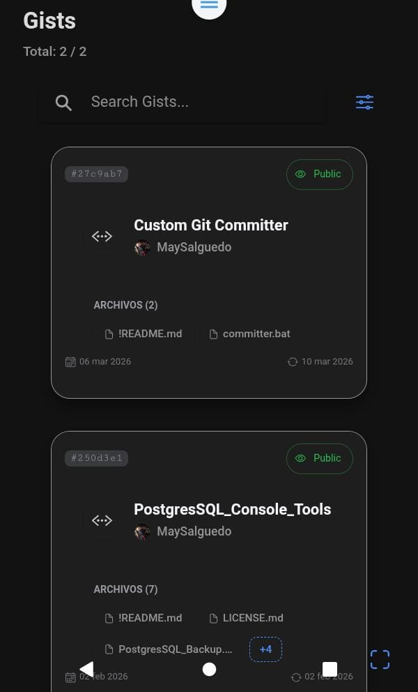
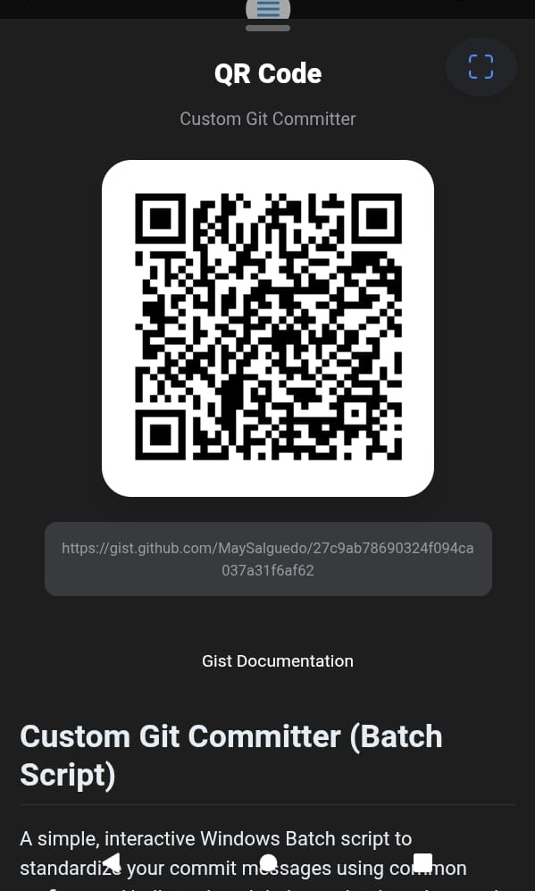

# Qode: GitHub Gist implementer & QR Scanner


[](https://angular.io)
[](https://ionicframework.com)
[](https://capacitorjs.com/)


## Overview

A dynamic mobile application that manages and shares your GitHub Gists instantly.
Built with Angular and Ionic Framework, **Qode** allows you to authenticate with your GitHub account,
view your code snippets, and discover other developers' Gists by seamlessly scanning QR codes using native device hardware.

## 🚀 Key Features

### 🔐 **GitHub API Integration**

- **Authenticated API Access**: Secure GitHub token integration for accessing personal Gists and higher rate limits.
- **Dynamic Gist Grid**: Automatically fetches and displays your Gist collection in a clean, responsive layout.
- **Live Markdown Rendering**: Extracts and professionally renders `README.md` files or code snippets directly inside the app.

### 📷 **Native QR Scanner**

- **Hardware Integration**: Utilizes Google ML Kit via Capacitor for lightning-fast barcode and QR scanning.
- **Smart ID Extraction**: Automatically parses scanned URLs or raw IDs to fetch the corresponding GitHub Gist data.
- **Instant Preview**: Scanned Gists instantly open a detailed modal with the code and author information.

### 🎨 **Professional UI Components**

- **Interactive Modals**: Detailed views of each snippet using custom Ionic modals (`GistQrModalComponent`).
- **Empty & Loading States**: Elegant feedback UI when fetching data or when no Gists are found.
- **Responsive Design**: Optimized for desktop, tablet, and mobile viewing.

## 🏗️ Project Architecture

Qode is built using a Modular Feature-Based Architecture (Domain-Driven Design), separating native hardware capabilities like QR scanning from core GitHub API logic to ensure high maintainability and scalability.

```text
src/
├── app/
│   ├── core/
│   │   ├── guards/            		 # Page's guards
│   │   ├── interceptors/            # Http interceptors
│   │   └── services/				 # Core services
│   │
│   ├── pages/						 # App pages
│   │
│   ├── shared/
│   │   ├── components/				 # Page's components
│   │	└── services/				 # Component services
│   │
│   ├── feature/
│   │   ├── components/				 # App components
│   │	└── services/				 # Component services
├── domain/
│   ├── entities/					 # Data entities and interfaces
│   └── models/                      # Data models and interfaces
├── environments/                    # Environment configurations
```

## 📱 App Screenshots

<div align="center">
  <table>
    <tr>
      <td align="center"><b>Home Screen</b></td>
      <td align="center"><b>QR Scanner</b></td>
    </tr>
    <tr>
      <td>
        
      </td>
      <td>
        
      </td>
    </tr>
  </table>
</div>

## 🛠️ Technology Stack

### Frontend & Mobile Framework

<ul>

<li> <strong>Angular</strong> - Modern component-based architecture.</li>

<li> <strong>Ionic Framework</strong> - Cross-platform UI components and theming.</li>

<li> <strong>Capacitor</strong> - Native bridge for accessing device hardware.</li>

</ul>

## 🚀 Quick Start

### Prerequisites

<ul>

<li> Node.js and npm </li>

<li> Angular CLI </li>

<li> Ionic CLI </li>

<li> Android Studio (for mobile compilation and debugging) </li>

</ul>

<ol>

<li><strong>Clone and Install</strong>

```Bash
git clone https://github.com/MaySalguedo/Qode.git
cd qode
npm install
```

</li>

<li><strong>Environment Set Up</strong>

For security reasons, environment configuration files are not tracked by Git. You must create them manually before running the app.
Create the <code>src/environments/</code> directory if it doesn't exist, and create a file named <code>environment.ts</code> inside it:

```TypeScript
export const environment = {
  production: false,
  github_api_url: 'https://api.github.com',
  github_app_client_id: 'YOUR_APP_CLIENT_ID',
  firebaseConfig: {
    apiKey: 'YOUR_API_KEY',
    authDomain: 'YOUR_AUTH_DOMAIN',
    projectId: 'YOUR_PROJECT_ID',
    storageBucket: 'YOUR_STORAGE_BUCKET',
    messagingSenderId: 'YOUR_MESSAGING_SENDER_ID',
    appId: 'YOUR_APP_ID',
  },
};

```

</li>

<li><strong>Run Development Server (Web)<strong>

```Bash
# Start application in browser
ionic serve
```

</li>

<li><strong>Run on Physical Device (Android Live Reload)<strong>

To test the native QR Scanner, you must run the app on a physical device:

```Bash
# Build web assets
ionic build
#  Add native Android project
npx cap add android
# Sync native Android project
npx cap sync android
# Run on device with Live Reload (Ensure PC and device are on the same Wi-Fi)
ionic cap run android -l --external
```

</li>

</ol>
